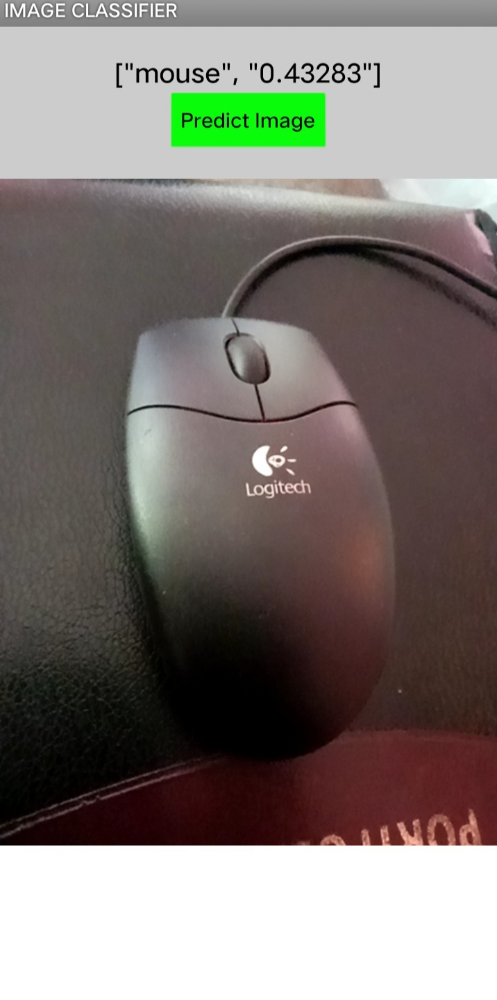

# Image Classifier App - MIT App Inventor

This is a simple Image Classifier app built using MIT App Inventor. It allows users to classify images using a custom model trained with Teachable Machine.

## Features
- Upload or capture an image
- Predict label using ML model
- Works offline on Android devices

## Built With
- MIT App Inventor
- Google Teachable Machine (for model training)

## Files
- `ImageClassifierApp.aia`: Editable project source
- `ImageClassifierApp.apk`: Installable Android file

## Installation
Download the `.apk` file and install it on your Android phone. Make sure you allow unknown sources.

## Demo

## Author
Sanjeev D
